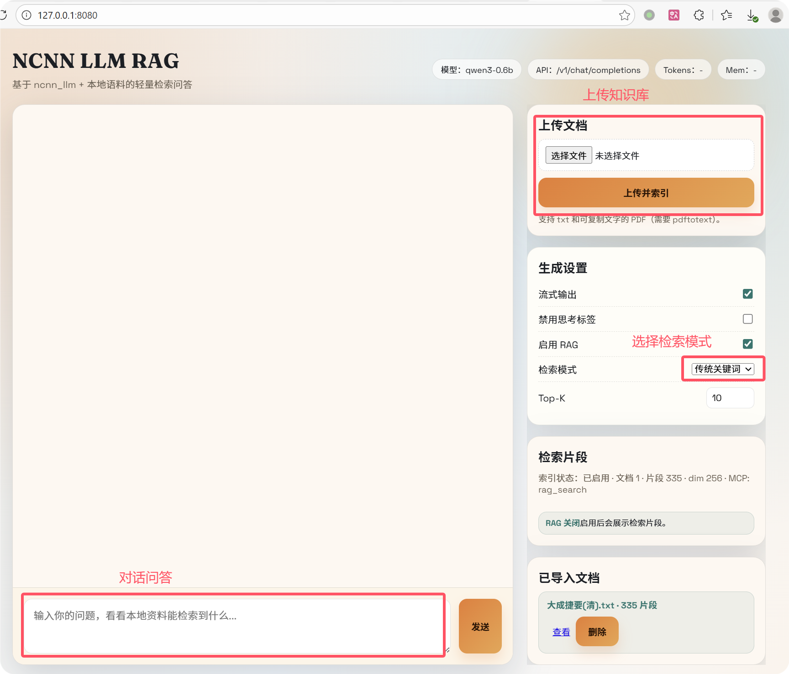
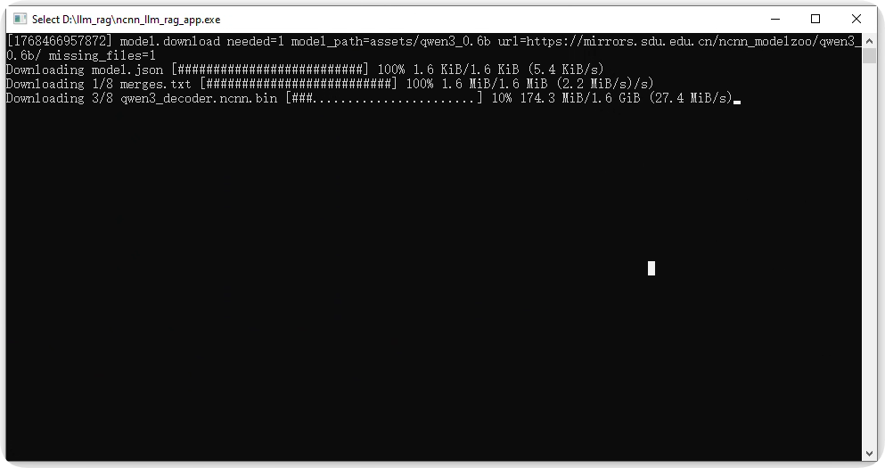
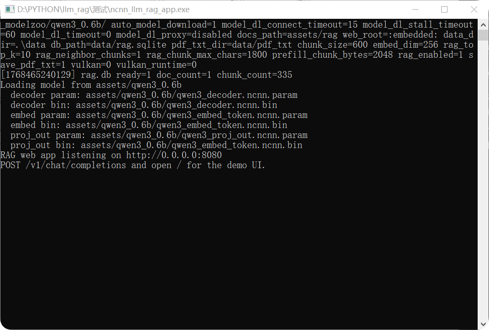

# HOWTOUSE（Web UI 使用说明）

本文档使用说明主要是这两部分：
- 如何上传知识文件并完成入库
- 如何在对话中切换检索模式、控制是否启用 RAG

## 1. 打开 Web 界面

启动程序后，在浏览器访问：

- `http://localhost:8080/`

如果你改了端口（`--port`），把 `8080` 换成对应端口即可。

### 首次启动：可能需要等待自动下载模型

如果本地模型目录（默认 `assets/qwen3_0.6b/`）缺少文件或不完整，程序会在启动阶段自动从默认镜像地址下载模型文件。此时：

- 终端会先打印 `model.download` 相关日志
- 下载完成后会继续启动 HTTP 服务并输出 `RAG web app listening on ...`
- 下载时间取决于网络速度与模型大小，首次运行可能需要等待较久

如果你处在离线环境或不希望自动下载，可以用 `--no-model-download` 禁用自动下载，并提前把模型文件放到 `--model` 指定的目录下。

 

 

## 2. 上传知识文件（入库）

右侧栏的 **上传文档** 卡片用于导入知识文件。

### 支持的文件类型

- `.txt`
- `.pdf`（需要系统安装 `pdftotext`，且 PDF 必须是“可复制文字”的类型；扫描版图片 PDF 通常无法直接提取文本）

### 上传步骤

1) 点击选择文件（`.txt` 或 `.pdf`）  
2) 点击 **上传并索引**  
3) 右侧会显示上传与索引流程日志（“索引步骤”）  
4) 完成后会提示“索引完成：xxx · N 片段”

### 编码说明（Windows 常见）

- 页面会在上传 `.txt` 前尝试自动识别并转换为 UTF-8，再提交到服务端。
- 如果你的浏览器不支持某些编码的解码（例如某些环境缺少 `gb18030` 支持），会在页面里提示“无法识别 txt 编码”。

### 上传后如何确认已入库

1) 看右侧 **检索片段** 里顶部的“索引状态”，会显示文档数/片段数  
2) 看右侧最下面的 **已导入文档** 列表，应该能看到刚导入的文件

## 3. 提问（对话）

左侧是对话区：

1) 在输入框输入问题  
2) 点击 **发送**  
3) 模型会在对话区输出回答  

如果开启了流式输出（默认勾选），回答会边生成边显示。

## 4. 启用/关闭 RAG（是否检索知识库）

右侧 **生成设置**：

- **启用 RAG**：打开后才会检索本地知识库并把命中片段注入到系统提示词中；关闭则变成“纯 LLM 对话”。

当 RAG 关闭时，右侧 **检索片段** 会显示“RAG 关闭”。

## 5. 切换检索模式（关键词如何生成）

右侧 **生成设置 → 检索模式** 提供三种模式：

- **传统关键词**：前端用简单的启发式规则从问题里抽取关键词，再用这些关键词去检索（速度快，适合多数中文问答）。
- **原始问题**：不做关键词抽取，直接用你的原问题作为检索输入（适合问题本身很短、信息密度很高的情况）。
- **LLM 关键词**：先调用一次模型把问题“提炼成关键词”，再用关键词去检索（检索更聚焦，但会多一次模型调用，整体更慢）。

建议：
- 想要速度/稳定：优先用 **传统关键词**
- 检索结果不相关：试试 **原始问题**
- 问题很长/很口语：试试 **LLM 关键词**

## 6. 调整检索数量（Top-K）

右侧 **生成设置 → Top-K** 控制检索返回的片段数：
- 数值越大：命中覆盖更广，但上下文更长、推理更慢、也更容易引入噪声
- 数值越小：更聚焦，但可能漏掉关键片段

一般建议从 `5~10` 开始试。

## 7. 查看检索命中与溯源

右侧 **检索片段** 卡片会展示：
- 你当前问题命中的片段列表（带来源/score）
- “打开原文”：跳转到 `/rag/doc/<id>#chunk-<N>`，可定位到被命中的 chunk

如果你发现模型回答不准确，建议先检查命中的片段是否包含答案（RAG 的核心是“检索对不对”）。

## 8. 常见问题

### 8.1 上传后一直没反应/卡住

可能原因：
- 上传在网络层卡住（Windows 上杀软/代理/系统网络栈更常见）
- 文件太大或浏览器解码/转码耗时

建议：
- 看右侧流程日志是否在更新（会显示上传进度/超时等）
- 先用小文件测试

### 8.2 PDF 上传后报 “contains no extractable text”

表示 `pdftotext` 没从 PDF 中提取到文字（常见于扫描版图片 PDF）。需要先 OCR 或换可复制文字的 PDF。
