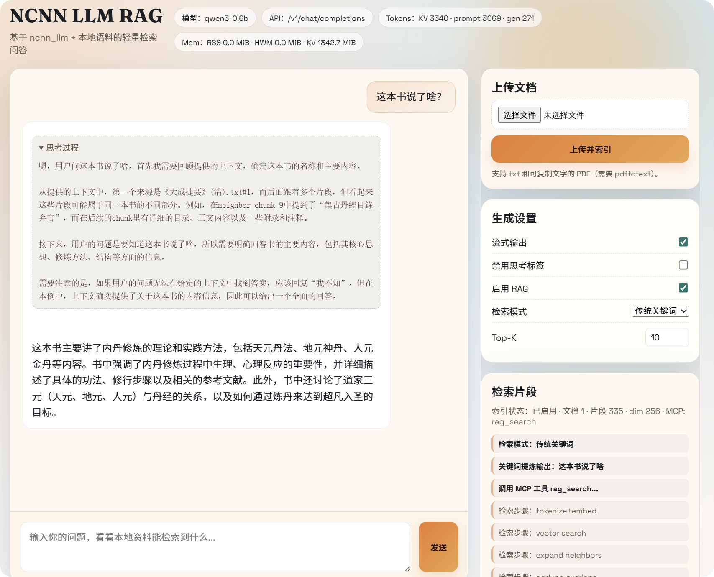

# ncnn-llm-rag-demo

[](https://github.com/chentyjpm/ncnn_llm-rag-demo/actions/workflows/ci-linux.yml)
[](https://github.com/chentyjpm/ncnn_llm-rag-demo/actions/workflows/ci-macos.yml)
[](https://github.com/chentyjpm/ncnn_llm-rag-demo/actions/workflows/ci-windows.yml)


基于 **ncnn** 的本地离线 LLM + RAG 检索增强问答 Demo（单个可执行程序 + 内置 Web UI），用于验证/调试 `ncnn_llm` 在文档检索场景下的集成效果。

Web UI 使用说明：[`HOWTOUSE.md`](HOWTOUSE.md)

配合来使用的项目/依赖：
- `ncnn_llm`：`ncnn_llm/`（本仓库以子模块/源码形式包含）
- `ncnn`：`find_package(ncnn CONFIG REQUIRED)`（通过 `ncnn_DIR` / `CMAKE_PREFIX_PATH` 查找）

## 目标

- 提供一个可离线运行的 RAG Web 应用：上传 PDF/TXT → 建库 → 检索 → 结合 LLM 回答




## 当前实现

可执行程序：
- `ncnn_llm_rag_app`：HTTP 服务端 + Web UI + OpenAI 兼容接口

内置功能：
- 文档上传与入库：`/rag/upload`
- 文档列表/查看/删除：`/rag/docs`、`/rag/doc/<id>`、`DELETE /rag/doc/<id>`
- RAG 检索工具（MCP 风格）：`/mcp/tools/list`、`/mcp/tools/call`（`rag_search`）
- OpenAI 兼容 Chat Completions：`POST /v1/chat/completions`
- PDF 导出 TXT：默认写入 `data/pdf_txt/`（可关闭）
- 检索扩展：命中 chunk 可自动拼接相邻 chunk，并做范围合并去重

## 构建

依赖：
- CMake
- C++17 编译器
- ncnn（必须能被 CMake `find_package(ncnn CONFIG)` 找到）

### 推荐：使用脚本下载 ncnn 预编译包（20260113）

脚本会下载并解压 Tencent/ncnn 的 release，并输出 `NCNN_PREFIX.txt`（供 `CMAKE_PREFIX_PATH` 使用）。

#### Linux / macOS

```bash
git submodule update --init --recursive

scripts/fetch_ncnn_20260113.sh --out deps/ncnn-prebuilt
export NCNN_PREFIX="$(cat deps/ncnn-prebuilt/NCNN_PREFIX.txt)"

cmake -S . -B build -DCMAKE_BUILD_TYPE=Release -DCMAKE_PREFIX_PATH="$NCNN_PREFIX"
cmake --build build -j
```

#### Windows（VS2022 / MSVC）

建议在 “Developer PowerShell for VS 2022” 中运行（确保 `cl.exe` 可用）：

```powershell
git submodule update --init --recursive

.\scripts\fetch_ncnn_20260113.ps1 -OutDir deps\ncnn-prebuilt -Arch x64
$env:NCNN_PREFIX = Get-Content deps\ncnn-prebuilt\NCNN_PREFIX.txt

cmake -S . -B build -DCMAKE_PREFIX_PATH="$env:NCNN_PREFIX" -A x64
cmake --build build --config Release
```

下载加速（代理）：

```powershell
.\scripts\fetch_ncnn_20260113.ps1 -OutDir deps\ncnn-prebuilt -Arch x64 -Proxy 192.168.8.3:18080
```

### 手动指定已安装的 ncnn（高级）

如果你已有自己安装的 ncnn（带 `ncnnConfig.cmake`），可以直接：

```bash
cmake -S . -B build -DCMAKE_BUILD_TYPE=Release -Dncnn_DIR="/path/to/ncnn/lib/cmake/ncnn"
cmake --build build -j
```

## 运行

启动服务：

```bash
./build/ncnn_llm_rag_app
```

命令行（CLI）输出示例：

```bash
./build/ncnn_llm_rag_app --help
```

```text
Usage: ./build/ncnn_llm_rag_app [options]
  --model PATH      Model directory (default: assets/qwen3_0.6b)
  --model-url URL   Model download base URL (default: https://mirrors.sdu.edu.cn/ncnn_modelzoo/qwen3_0.6b/)
  --model-dl-connect-timeout N  Connect timeout in seconds (default: 15)
  --model-dl-stall-timeout N    Abort if transfer stalls for N seconds (default: 60)
  --model-dl-timeout N          Overall timeout per file (0=disable, default: 0)
  --model-dl-proxy HOST:PORT    Use HTTP proxy for downloads (default: none)
  --no-model-dl-proxy           Disable download proxy
  --docs PATH       Seed docs directory (default: assets/rag)
  --web PATH        Web root to serve (default: :embedded:)
  --data PATH       Data directory (default: data)
  --db PATH         SQLite database path (default: data/rag.sqlite)
  --pdf-txt PATH    Exported PDF text directory (default: data/pdf_txt)
  --chunk-size N    Chunk size for indexing (default: 600)
  --embed-dim N     Embedding dimension (default: 256)
  --port N          HTTP port (default: 8080)
  --rag-top-k N     Retrieved chunks (default: 10)
  --rag-neighbors N Include neighbor chunks around each hit (default: 1)
  --rag-chunk-max N Max chars per returned chunk after expansion (default: 1800)
  --prefill-chunk-bytes N Chunk prompt for prefill to reduce memory (default: 2048)
  --no-model-download Disable automatic model download
  --no-rag          Disable retrieval
  --no-pdf-txt      Disable exporting extracted PDF text
  --vulkan          Enable Vulkan compute
  --llm-backend NAME  LLM backend: local|api (default: local)
  --api-base URL      OpenAI-compatible base URL, e.g. https://api.openai.com/ (or .../v1/)
  --api-key KEY       API key (or env OPENAI_API_KEY / NCNN_RAG_API_KEY)
  --api-model NAME    Override request model when using --llm-backend api
  --api-timeout N     API connect/read timeout seconds (default: 120)
  --api-proxy HOST:PORT  Use HTTP proxy for API requests
  --api-no-verify     Disable TLS certificate verification for API
  --help            Show this help
```

默认监听：
- Web UI：`http://localhost:8080/`
- OpenAI 接口：`POST http://localhost:8080/v1/chat/completions`

## 在线 API 模式（OpenAI 兼容）

如果你想让本程序把 LLM 推理改为调用在线 API（仍保留 Web UI / RAG / OpenAI 兼容本地接口），可以：

```bash
export OPENAI_API_KEY="YOUR_KEY"
./build/ncnn_llm_rag_app \
  --llm-backend api \
  --api-base https://api.openai.com/ \
  --api-model gpt-4o-mini
```

说明：
- `--api-base` 支持传 `https://xxx/` 或 `https://xxx/v1/`（程序会自动补默认 `/v1/`）
- `--api-model` 用于覆盖前端/客户端传来的 `model`（Web UI 默认会传 `qwen3-0.6b`，在线 API 一般需要改成你的模型名）
- `stream=true` 会透传上游的 SSE 流；若上游用 `reasoning_content` 单独返回思考过程，会自动合并为 `<think>...</think>` 以便 Web UI 展示

常用参数（可执行程序 `--help` 查看完整说明）：
- `--model PATH`：模型目录（默认 `assets/qwen3_0.6b`）
- `--model-url URL`：模型下载地址（默认 `https://mirrors.sdu.edu.cn/ncnn_modelzoo/qwen3_0.6b/`，当模型缺失/不完整时会自动下载）
- `--model-dl-stall-timeout N`：下载卡住超时（默认 60 秒，避免网络异常时一直等待）
- `--no-model-download`：禁用自动下载（离线环境建议打开）
- `--web PATH`：Web 静态资源目录（默认内置 `:embedded:`；如需本地开发可设为 `src/web`）
- `--db PATH`：SQLite DB（默认 `data/rag.sqlite`）
- `--pdf-txt PATH`：PDF 导出 txt 目录（默认 `data/pdf_txt`）
- `--chunk-size N`：切片大小（默认 600）
- `--rag-top-k N`：检索返回数量（默认 10）
- `--rag-neighbors N`：命中 chunk 前后扩展（默认 1）
- `--rag-chunk-max N`：扩展后单段最大字符数（默认 1800）
- `--no-pdf-txt`：禁用 PDF→TXT 导出
- `--no-rag`：禁用检索（纯 LLM）

## HTTP API

### Chat Completions（OpenAI 风格）

```bash
curl -s http://localhost:8080/v1/chat/completions \
  -H 'Content-Type: application/json' \
  -d '{
    "model": "qwen3-0.6b",
    "stream": false,
    "rag_mode": "server",
    "rag_enable": true,
    "messages": [
      {"role":"user","content":"储能电站有哪些分类？"}
    ]
  }'
```

### 上传文档入库

```bash
curl -s http://localhost:8080/rag/upload \
  -F "file=@./your.pdf"
```

服务端会把原文件保存到 `data/uploads/`，并在开启 `save_pdf_txt` 时把 PDF 解析后的文本保存到 `data/pdf_txt/`。

### 文档列表/查看/删除

- 列表：`GET /rag/docs`
- 查看：`GET /rag/doc/<doc_id>`（HTML，可用 `#chunk-N` 定位）
- 删除：`DELETE /rag/doc/<doc_id>`

### MCP tools（RAG 检索）

```bash
curl -s http://localhost:8080/mcp/tools/call \
  -H 'Content-Type: application/json' \
  -d '{"name":"rag_search","arguments":{"query":"用户侧储能 是什么","top_k":10}}'
```

## 日志与调试

程序会向 `stderr` 输出关键链路日志（如：模型加载、RAG 入库/检索、MCP 调用、prompt 构建、prefill/generate 过程、错误堆栈/trace）。

## 致谢

- Tencent/ncnn
- `ncnn_llm`
